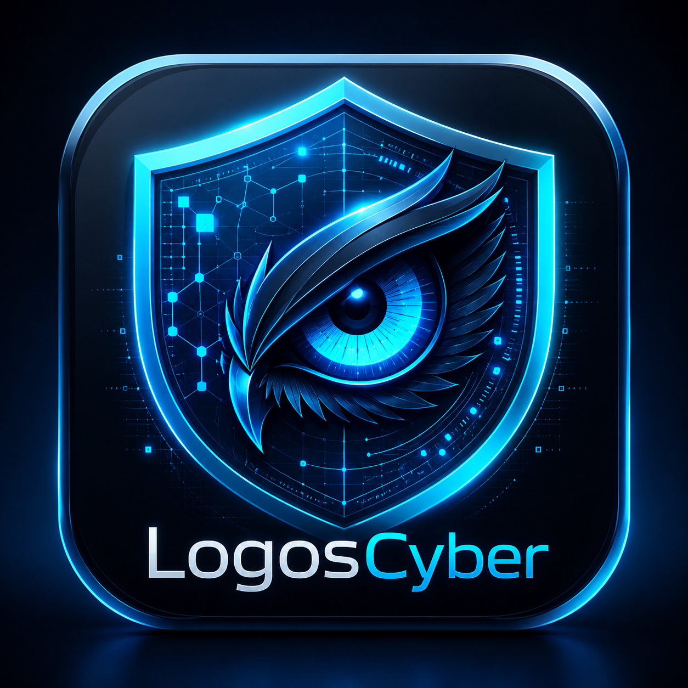

# 🛡️ LogosCyber: LLM-Powered Nuclei Template Generator & Scanner

<p align="center">
  
  <br>
  <span>Developed by <b><a href="https://github.com/olbin-dev">@olbin-dev</a></b></span>
</p>

LogosCyber is a lightweight native desktop GUI application written in Rust. It leverages the Google Gemini API to automatically generate **Nuclei-compatible YAML vulnerability scanning templates** from natural language prompts, allowing you to run quick verification scans against your targets immediately.

---

## 🌟 Key Features

*   **🤖 AI Template Generation**:
    Create templates simply by describing what you want to test (e.g., "Check if `/wp-config.php.bak` exists" or "Verify custom headers").
*   **⚡ On-the-Fly Scanning**:
    Instantly execute the generated or custom YAML template against a target URL to check for vulnerability matches.
*   **📂 Multi-Template Directory Loading**:
    Load a local directory containing multiple Nuclei templates to run sequential scans.
*   **🔒 Gemini Direct + Scan via SOCKS**:
    *   Gemini API stays a direct HTTPS connection (not forced through VPN).
    *   Scan traffic defaults to `socks5://127.0.0.1:1080` with **Require Proton proxy** kill-switch (scan refused if the proxy is down).
    *   Optimized safety settings (`BLOCK_NONE`) prevent AI from falsely blocking security-related templates.
*   **🛡️ Proton without the Proton VPN app**:
    *   Use a dashboard WireGuard `.conf` + `tunmux --local-proxy` so only LogosCyber scans exit via Proton.
    *   See [docs/PROTON_SOCKS.md](docs/PROTON_SOCKS.md).
*   **🚀 Lightweight Native UI**:
    Uses the `eframe` (egui) library to provide a fast and lightweight native application experience (consuming only a few megabytes of RAM).

---

## 🛠️ Prerequisites

*   **Rust (Cargo)** toolchain installed.
*   **Google Gemini API Key** (available for free via Google AI Studio).
*   **Optional (recommended for scanning)**: Proton WireGuard `.conf` + [tunmux](https://github.com/CaddyGlow/tunmux) local SOCKS — see [docs/PROTON_SOCKS.md](docs/PROTON_SOCKS.md).

---

## 🚀 Build and Run

```bash
# Clone the repository
git clone https://github.com/OS-Sovereign/logos-cyber.git
cd logos-cyber

# Build and run the application
cargo run --release
```

---

## 📖 How to Use

1.  **Start Proton SOCKS** (recommended): place `proton.conf`, then `./scripts/proton_socks/start_socks.sh` (or install the LaunchAgent). Confirm UI shows `Proxy: OK`.
2.  **Set Target**: Input the target URL/IP in the `Target URL / IP` field in the top-left panel.
3.  **Enter API Key**: Provide your Gemini API key in the `Gemini API Key` field (input is masked for security).
4.  **Prompt the AI**: Describe what you want to test in the `What to test?` text area.
    *   *Example: "Create a template to check if accessing `/admin` returns a 403 Forbidden status code."*
5.  **Generate**: Click the `💡 Generate with AI` button. The generated YAML code will appear in the quick template editor in the center.
6.  **Scan**: Click `🚀 Run Quick Scan (Text)`. With Require Proton proxy ON, scans are blocked if SOCKS is down (home IP leak prevention).

---

## ⚠️ Disclaimer

*   This tool is for **authorized security testing and educational research purposes only**.
*   Do not scan targets without explicit prior permission from the owner.
*   The developer assumes no liability for any misuse or damage caused by this application.

---

## 📝 License

This project is licensed under the **MIT License**. See the `LICENSE` file for details.

---

## 🧠 LogosCyber vs. Anthropic's Claude Mythos

Here is a quick overview of how **LogosCyber** compares to Anthropic's restricted cybersecurity model, **Claude Mythos**:

| Feature / Dimension | 🧠 Anthropic's Claude Mythos | 🛡️ LogosCyber (This Tool) |
| :--- | :--- | :--- |
| **Concept & Nature** | A closed-source, military/government-restricted frontier AI model. | An open-source, lightweight, local-first developer utility. |
| **Operation Model** | Autonomous agent that finds and exploits vulnerabilities internally. | Uses general LLMs to compile natural language into Nuclei YAML. |
| **Execution Engine** | Monolithic AI agent handles both reasoning and packet execution. | Hybrid: AI handles template generation; a deterministic **Rust engine** runs the scan. |
| **Availability** | Restricted and unreleased to the public due to dual-use offense risks. | Openly available on GitHub; you bring your own Gemini/LLM API key. |
| **Footprint** | Extremely heavy computing requirements. | Ultra-lightweight (consumes only a few MBs of RAM). |

### Why LogosCyber's Hybrid Approach?
*   **Privacy & Sovereignty**: Directly connects to Google's Gemini API with your own key—no intermediate proxies.
*   **No Safety Gatekeeping**: Automatically sets Gemini's safety settings to `BLOCK_NONE` to prevent false positive safety blocks on benign vulnerability templates.
*   **Deterministic Rust Speed**: AI is only used for the creative phase (generating the YAML code). The actual HTTP request execution and regex pattern matching are delegated to a native Rust binary.

---

### 🇯🇵 LogosCyber と Anthropic's Claude Mythos の違い

LogosCyber と、Anthropicが発表したサイバーセキュリティ特化型モデル「Claude Mythos」の主な違いは以下の通りです。

*   **設計コンセプト**: Claude Mythos は一般非公開の超巨大・特化型AIモデルですが、LogosCyber は「開発者が手元で安全かつ軽量に動かせるローカルファーストのオープンソースツール」です。
*   **知能の役割分担（ハイブリッド設計）**: MythosはAI自身がスキャンや攻撃コードの実行まで行いますが、LogosCyberは**「テンプレート（YAML）の生成フェーズのみをAI（Gemini）に任せ、実際のスキャン実行はRust製の超軽量エンジンに任せる」**という役割分担を行っています。
*   **自己主権（Sovereignty）**: ユーザー自身のAPIキーで直接Google APIと通信するため、データが他のプロキシに吸い込まれるリスクがありません。


---

## 🇯🇵 日本語概要 (Japanese Overview)

LogosCyber は、Google Gemini API を活用して自然言語のプロンプトから **Nuclei 互換の脆弱性スキャン用 YAML テンプレート**を自動生成し、その場ですぐにターゲットに対して簡易スキャンを実行できる Rust 製のネイティブ GUI アプリケーションです。

*   **自然言語からの生成**: 「`/admin` にアクセスした際に 403 Forbidden が返ってくるか確認するテンプレートを作って」などの指示からYAMLを自動生成。
*   **直接通信**: ローカルプロキシを中継せず、直接 Gemini API と通信するため安全です。
*   **軽量・高速**: `eframe` (egui) を用いて構築されており、極めて少ないメモリ消費で動作します。

*(※詳細なビルド方法や使い方は、上記の英語セクションをご参照ください)*
